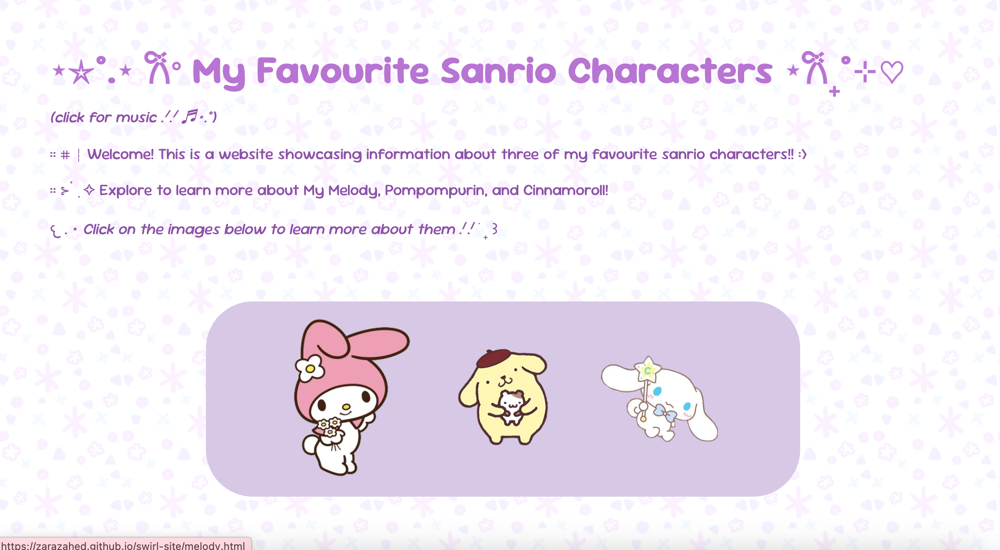
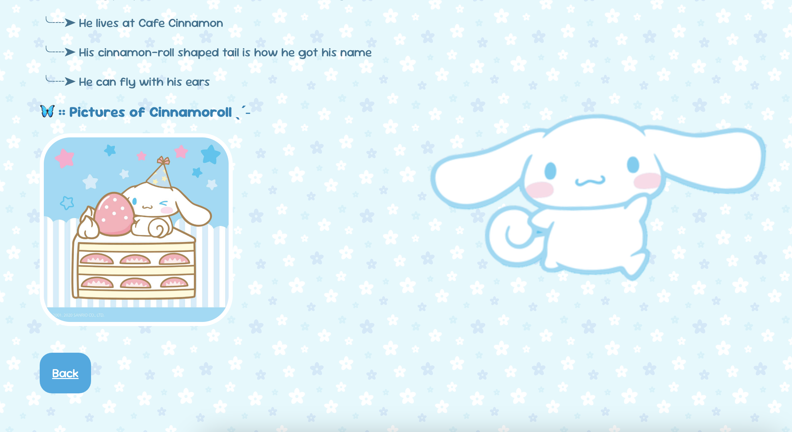
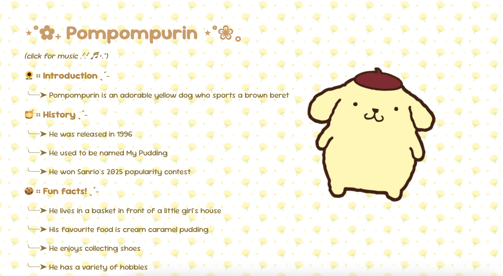

# This project is called My Favourite Sanrio Characters! 

### What my project is/does:
> It's an adorable site where I can yap about my favourite sanrio characters, and potentially add more in the future!
> There are pages for My Melody, Pompompurin, and Cinnamoroll.
> Here are some screenshots!
>
> 
> 
> 
>
### How you can view my project
> Click here: https://zarazahed.github.io/swirl-site/index.html
> 
### Why I made my project:
> I wanted to play around with CSS and make something that looks  pretty cute.
> I also felt like trying out some new techniques to elevate a static site!
> 
### How I made my project
> I utilized HTML, CSS, JavaScript to make the site!

### What I struggled with and what I learned:
> I struggled with creating the home page, particularly the bit where you can hover over the icons and they expand.
> I also had some issues with adding music to the sites.
> I learned how to fix these issues by looking for tutorials! :)
>
#### Credits
> Images from Google and music from YouTube

